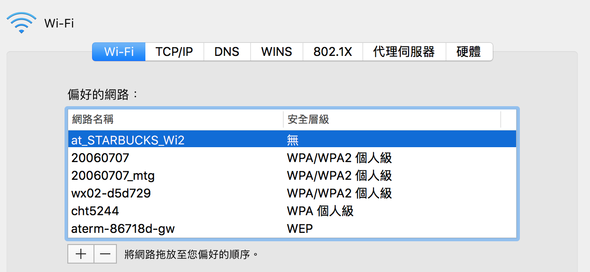

## Starbucks WiFi auto-connector
A python script check wifi connectivity when accessing WiFi at Starbucks
and re-login if necessary to make life easier.

### Prerequisite
- OSX
- Chrome

Make sure the Starbucks Wifi is at the top of your Wifi List. 



#### Environment setting
Install dependencies inside the repo by using

Conda:
```commandline
conda create -f environment.yaml
```
Pip:
```commandline
pip install -r requirements.txt
```


### Usage
Open your CLI, direct to the repo and run
```commandline
python keep_wifi_alive.py
```

and you're done.
